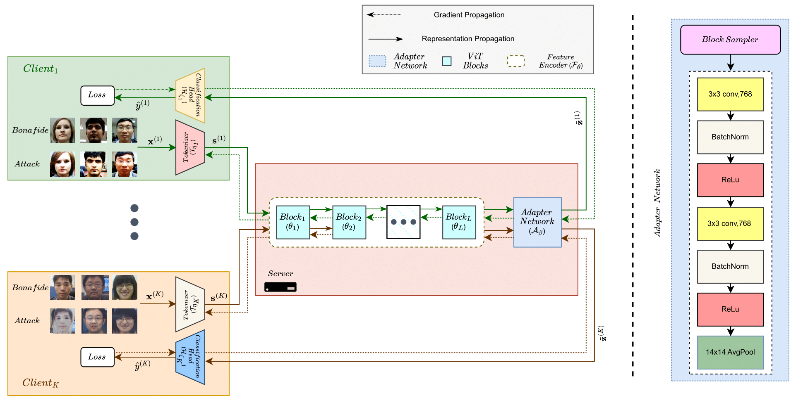

<p align="center">

  <h2 align="center"><strong>FedSIS: Federated Split Learning with Intermediate Representation Sampling for Privacy-preserving Generalized Face Presentation Attack Detection</strong></h2>

  <h3 align="center"><span style="font-size:1em;" color><strong>IJCB 2023 (ORAL)</strong></span>
  </h3>

  <p align="center">
    <a href="https://scholar.google.com/citations?user=VqkZplQAAAAJ&hl=en&oi=sra"><strong> Naif Alkhunaizi</strong>*</a>,
    <a href="https://koushiksrivats.github.io"><strong> Koushik Srivatsan</strong>*</a>,
    <a href="https://scholar.google.com/citations?user=NoDVDuYAAAAJ&hl=en&oi=sra"><strong> Faris Almalik</strong>*</a>,
    <a href="https://scholar.google.com/citations?user=T9MTcK0AAAAJ&hl=en&oi=sra"><strong> Ibrahim Almakky</strong></a>,
    <a href="https://scholar.google.com/citations?user=2qx0RnEAAAAJ&hl=en"><strong> Karthik Nandakumar</strong></a>
    <br>
    <span style="font-size:1em; "><strong> MBZUAI, UAE</strong>.</span>
    <br>
    <span style="font-size:0.5em; ">* Equal Contribution</span>
  </p>
</p>

<p align="center">
  <a href="https://arxiv.org/abs/2308.10236" target='_blank'>
    
  </a> 
</p>


## Updates :loudspeaker:
  - **[21-08-2023]**: Code will be released soon.
  - **[08-08-2023]**: Paper accepted to IJCB 2023 for ORAL Presentation. :tada:


## Abstract :newspaper:
<p align="center">
  
</p>

<!-- <p align="justify"> -->
<!-- <em> -->
> *Lack of generalization to unseen domains/attacks is the Achilles heel of most face presentation attack detection (FacePAD) algorithms. Existing attempts to enhance the generalizability of FacePAD solutions assume that data from multiple source domains are available with a single entity to enable centralized training. In practice, data from different source domains may be collected by diverse entities, who are often unable to share their data due to legal and privacy constraints. While collaborative learning paradigms such as federated learning (FL) can overcome this problem, standard FL methods are ill-suited for domain generalization because they struggle to surmount the twin challenges of handling non-iid client data distributions during training and generalizing to unseen domains during inference. In this work, a novel framework called Federated Split learning with Intermediate representation Sampling (FedSIS) is introduced for privacy-preserving domain generalization. In FedSIS, a hybrid Vision Transformer (ViT) architecture is learned using a combination of FL and split learning to achieve robustness against statistical heterogeneity in the client data distributions without any sharing of raw data (thereby preserving privacy). To further improve generalization to unseen domains, a novel feature augmentation strategy called intermediate representation sampling is employed, and discriminative information from intermediate blocks of a ViT is distilled using a shared adapter network. The FedSIS approach has been evaluated on two well-known benchmarks for cross-domain FacePAD to demonstrate that it is possible to achieve state-of-the-art generalization performance without data sharing.*
<!-- </em> -->
<!-- </p> -->


## Main Contributions :star2:

1) **Collaborative Learning Framework:** We propose a collaborative learning framework for FacePAD based on a hybrid ViT architecture, which consists of a convolution-based tokenizer, self-attention-based feature encoder, and a linear classifier. While the tokenizer and classifier components are domain/client-specific and learned in a federated way, the shared feature encoder is learned using split learning and serves to align the source domains.
2) **Feature Augmentation:** To further enhance the generalizability of the above framework, we propose a novel feature augmentation strategy, where representations learned by intermediate blocks of the ViT are sampled and processed through a shared adapter network before classification.
3) **State-of-the-Art Performance:**  We empirically demonstrate that the proposed **FedSIS** approach can outperform even state-of-the-art centralized DG-FacePAD methods while ensuring data privacy for the participating clients.


## Instruction for Code usage :computer:

Please refer to [run.md](docs/run.md) for instructions on environment setup, dataset pre-processing, downloading pre-trained weights, training and evaluating each protocol.

## Citation :label:
If you're using this work in your research or applications, please cite using this BibTeX:
```bibtex
@article{alkhunaizi2023fedsis,
  title={FedSIS: Federated Split Learning with Intermediate Representation Sampling for Privacy-preserving Generalized Face Presentation Attack Detection},
  author={Alkhunaizi, Naif and Srivatsan, Koushik and Almalik, Faris and Almakky, Ibrahim and Nandakumar, Karthik},
  journal={arXiv preprint arXiv:2308.10236},
  year={2023}
}
```